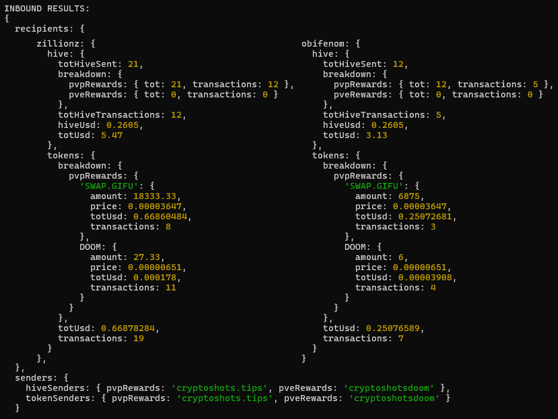

# Hive Rewards

An SDK for Node.js and the browser, and a command‑line tool to scan HIVE and Hive‑Engine token transfers:

- **Inbound** — sum HIVE & tokens and USD value received by specified accounts, tracking specific sender accounts.
- **Outbound** — map all recipients, tokens and USD values sent by a given sender.


---

## Usage - NodeJS and Browser

```js
import { hiveRewards } from 'hiverewards';

const analyzer = await hiveRewards({ verbose: true });

const inbound = await analyzer.inbounds({
  receivers: ['zillionz', 'obifenom'],
  hiveSenders: { PVP_HIVE: 'cryptoshots.tips' },
  tokenSenders: { PVP_TOKENS: 'cryptoshots.tips' },
  hours: 2,
});
console.log(inbound);

const outbound = await analyzer.outbounds({
  senders: ['cryptoshots.tips', 'karina.gpt'],
  days: 1,
});
console.log(outbound);
```


#### Self-hosted bundle

A bundled build can be generated with Webpack:

1. Clone the project

2. Build it with
```bash
npm run build:web        # outputs dist/hiverewards.bundle.js
```

3. Host the generated dist folder on your server
4. Import it in your frontend and use it this way:

```html
<script src="dist/hiverewards.bundle.js"></script>
<script>
  (async () => {
    const analyzer = await window.HiveRewards.hiveRewards();
    const result = await analyzer.inbounds({
      receivers: ['obifenom'],
      hiveSenders: { PVP_GAME_REWARDS: 'cryptoshots.tips' },
      days: 7,
    });
    console.log(result);
  })();
</script>
```
-----

## Usage - CLI

```bash
git clone <repo>
cd <repo>
npm install
```

```bash
npm start -- --inbound obifenom zillionz --from pvpRewards=cryptoshots.tips pveRewards=cryptoshotsdoom --hours 24
```
<center>



</center>

```bash
npm start -- --outbound cryptoshots.tips cryptoshotsdoom karina.gpt --days 2
```

<center>


</center>

Note: append `--verbose` for verbose logging

-----

## Configuration

| Env var                       | Default                                                        |
|-------------------------------|----------------------------------------------------------------|
| `HIVE_NODE_URL`               | `https://api.hive.blog`                                        |
| `HIVE_PRICE_URL`              | `https://api.coingecko.com/api/v3/simple/price?ids=hive&vs_currencies=usd` |
| `HIVE_ENGINE_HISTORY_URL`     | `https://history.hive-engine.com/accountHistory`               |
| `HIVE_ENGINE_RPC_URL`         | `https://enginerpc.com/contracts`                              |

You can also override any of the defaults by passing a config object to the `hiveRewards()` factory in code.

<br>

---

## Peakd's Beacon Wrapper usage

Wrapper for [@peakd](https://peakd.com/@peakd)'s [Beacon](https://beacon.peakd.com) APIs.

```js
import { peakdBeaconWrapper } from 'hiverewards';

const { getHealthyHiveNode, getHealthyHeNode, getHealthyHeHistoryNode } = peakdBeaconWrapper;
const hiveUrl = await getHealthyHiveNode();
const heUrl = await getHealthyHeNode();
const hehUrl = await getHealthyHeHistoryNode();

// Now you can configure your client:
hiveApi.api.setOptions({ url: hiveUrl });
```

<br>

---

## Support us

- #### [VOTE](https://vote.hive.uno/@crypto-shots) for our witness
- Use the Issues tab to report bugs.
- Create Merge Requests for potential improvements and fixes.

-----

### WIP

- Full Code Review
- Split into files
- Update images in readme
- Add beacon to readme
- Cleanup, add to github, npm publish
- Retest imports
&nbsp;
- USAGE IN CS: Scheduler add to weekly/monthly (buy + stats), add to tournament result (1h), later: add to game UIs
- Tweet/blog/MM
&nbsp;
- Flattener
- OLD LISTS !!!
