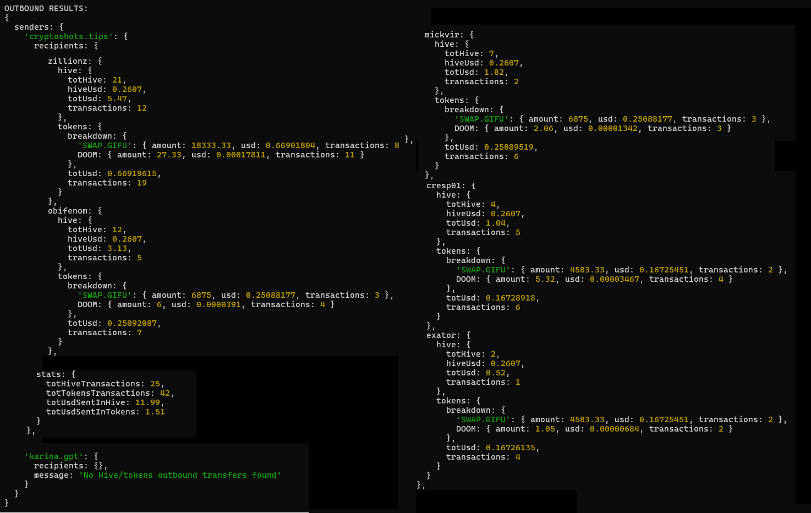

&nbsp;

📑 **CONTENTS**
&nbsp;
- 💸 **[Hive Rewards]()** [usage – NodeJS & Browser](#usage---nodejs--browser)  
  - [CLI Usage](#usage---cli)  
  - [Custom Configuration](#configuration)
&nbsp;
- 😺 **[Peakd’s Beacon Wrapper](#peakds-beacon-wrapper)** &nbsp;and &nbsp;**[Hive / HiveEngine API Wrappers](#peakds-beacon-wrapper)**

&nbsp;

-----

# Hive Rewards

An SDK for Node.js and the browser, and a command‑line tool to scan HIVE and Hive‑Engine token transfers:

- **Inbound** — sum HIVE & tokens and USD value received by specified accounts, tracking specific sender accounts.
- **Outbound** — map all recipients, tokens and USD values sent by a given sender.


---

## Usage - NodeJS and Browser

```js
import { hiveRewards } from 'hiverewards';

const analyzer = await hiveRewards({ verbose: true });

const inbound = await analyzer.inbounds({
  receivers: ['zillionz', 'obifenom'],
  hiveSenders: { PVP_HIVE: 'cryptoshots.tips' },
  tokenSenders: { PVP_TOKENS: 'cryptoshots.tips' },
  hours: 2,
});
console.log(inbound);

const outbound = await analyzer.outbounds({
  senders: ['cryptoshots.tips', 'karina.gpt'],
  ignoredReceivers: ['keychain.swap'],
  days: 1,
});
console.log(outbound);
```


#### Self-hosted bundle

A bundled build can be generated with Webpack:

1. Clone the project

2. Build it with
```bash
npm run build:web        # outputs dist/hiverewards.bundle.js
```

3. Host the generated dist folder on your server
4. Import it in your frontend and use it this way:

```html
<script src="dist/hiverewards.bundle.js"></script>
<script>
  (async () => {
    const analyzer = await window.HiveRewards.hiveRewards();
    const result = await analyzer.inbounds({
      receivers: ['obifenom'],
      hiveSenders: { PVP_GAME_REWARDS: 'cryptoshots.tips' },
      days: 7,
    });
    console.log(result);
  })();
</script>
```
-----

## Usage - CLI

```bash
git clone <repo>
cd <repo>
npm install
```

```bash
npm start -- --inbound obifenom zillionz --from pvpRewards=cryptoshots.tips pveRewards=cryptoshotsdoom --hours 24
```
<center>


</center>

```bash
npm start -- --outbound cryptoshots.tips karina.gpt --days 1
```

<center>



</center>

Note: append `--verbose` for verbose logging

-----

## Configuration

| Env var                       | Default                                                        |
|-------------------------------|----------------------------------------------------------------|
| `HIVE_PRICE_URL`              | `https://api.coingecko.com/api/v3/simple/price?ids=hive&vs_currencies=usd` |

You can also override the initial Hive / Hive Engine node by passing a config object to the `hiveRewards()` factory in code.
eg.
```js
const analyzer = await hiveRewards({
  hiveNodeUrl: 'https://your.hive.node',
  hiveEngineRpcUrl: 'https://your.he.rpc',
  hiveEngineHistoryUrl: 'https://your.he.history',
});
```

**Other Overrides:**

| Constructor Attribute | Description | Default |
|-------------------------------|---------------------------|-----------------------------|
| fetch             | Fetch API implementation |                       `npm cross-fetch`|
| hiveJs            | pass in another @hiveio/hive-js version, if needed |   v2 |
| log               | custom logger |                                         console |
| apiCallsDelay     | default wait time for api call retries |                500 (with exp backoff) |
| priceCacheMins    | how long Hive price is cached for |                     10 mins |
| hiveHistoryLimit  | page size (max account‐history ops per call) |          500 |
| heHistoryLimit    | page size (max Hive-Engine history records per call)  |          250 |


<br>

---

# Peakd's Beacon Wrapper

Wrapper for [@peakd](https://peakd.com/@peakd)'s [Beacon](https://beacon.peakd.com) APIs.

**Usage:**

```js
import { peakdBeaconWrapper } from 'hiverewards';

const { getHealthyHiveNode, getHealthyHeNode, getHealthyHeHistoryNode } = peakdBeaconWrapper;
const hiveUrl = await getHealthyHiveNode();
const heUrl = await getHealthyHeNode();
const hehUrl = await getHealthyHeHistoryNode();

// Now you can configure your client:
hiveApi.api.setOptions({ url: hiveUrl });
```

...our use our Hive / Hive Engine **client wrappers** that automatically rotate healthy nodes:


```js
import { healthyApisWrapper } from 'hiverewards';

const { hiveApiCall, hiveEngineApiCall, hiveEngineHistoryApiCall } = healthyApisWrapper;

const history = await hiveApiCall('getAccountHistory', ['cryptoshotsdoom', -1, 10]);
console.log(history);

const metrics = await hiveEngineApiCall({
  jsonrpc: '2.0',
  method:  'find',
  params: {
    contract: 'market',
    table:    'metrics',
    query:    { symbol: 'DOOM' },
    limit:    1,
    offset:   0
  },
  id: 1
});
console.log(metrics);

const history = await hiveEngineHistoryApiCall('cryptoshotstips', 20);
console.log(history);
```

<br>

---

## Support us

- #### [VOTE](https://vote.hive.uno/@crypto-shots) for our witness 🙇‍♂️
- Use the [Issues](https://github.com/Crypto-Shots/Hive-Earnings/issues) tab to report bugs.
- Create [Merge Requests](https://github.com/Crypto-Shots/Hive-Earnings/pulls) for potential improvements and fixes.

<br>
